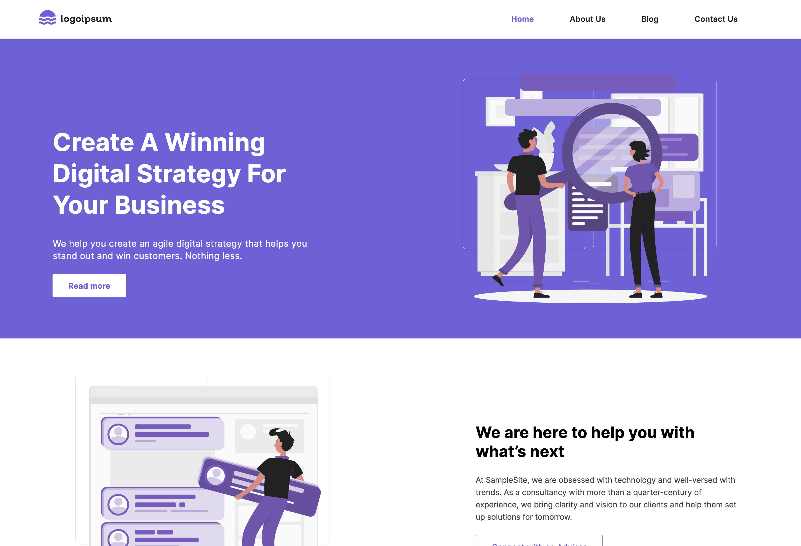
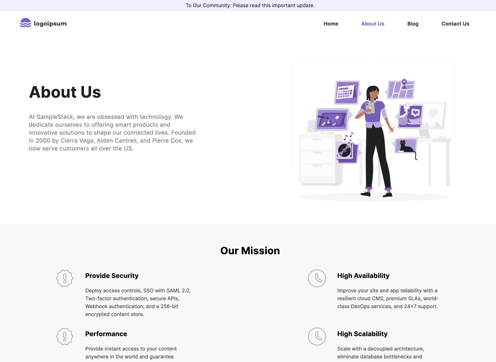
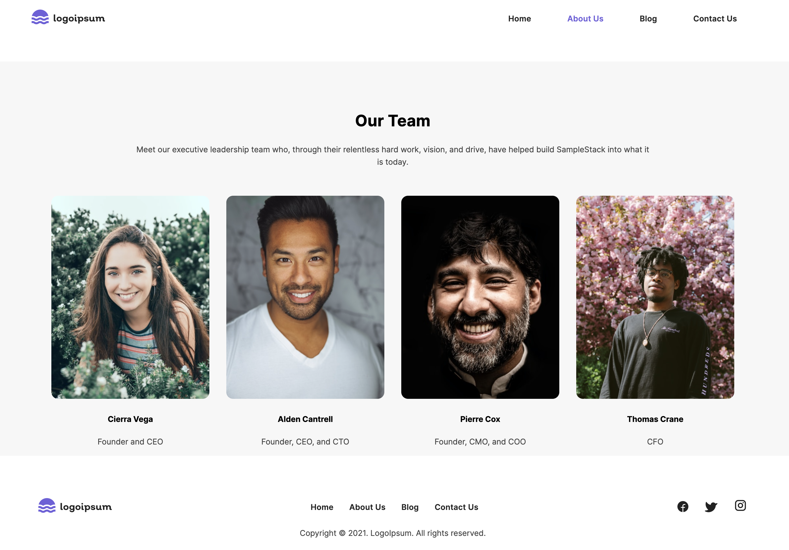
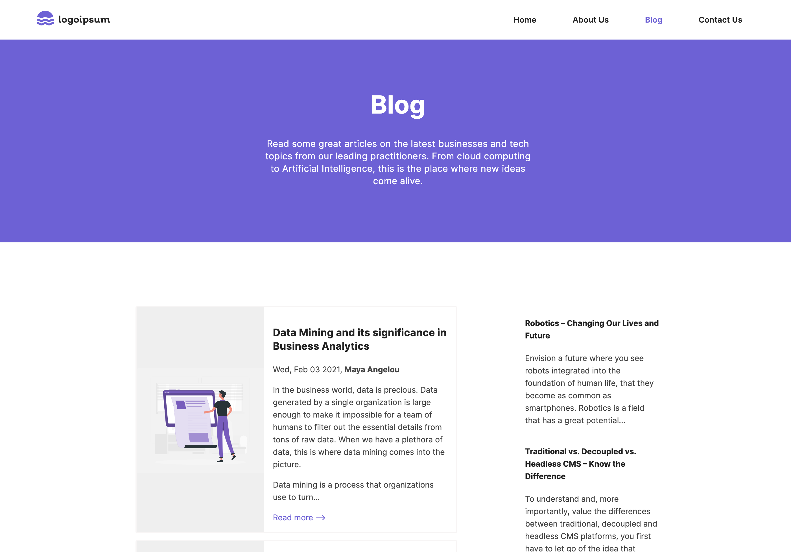
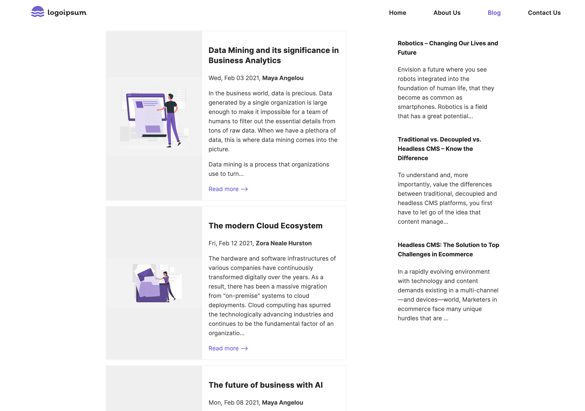
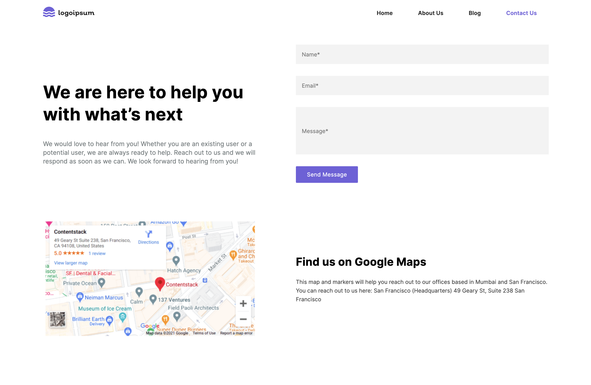

## GraphQl-Spring-Boot-Client Example Web App

### Quick starter for graphql api integration in spring boot

Spring Boot is an open-source framework that allows Java developers to create production-grade Spring applications.

This step-by-step guide details how to create a Java sample app via Spring Boot. This app, powered by Contentstack’s Java SDK, uses GraphQL API to fetch content stored in Contentstack and display it on your application.

## Prerequisites

-   A text editor or an IDE, for example, [IntelliJ IDEA](https://www.jetbrains.com/idea/download/)

-   [JDK 1.8 or later](https://www.oracle.com/in/java/technologies/javase/javase-jdk8-downloads.html)

-   Gradle 4+ or Maven 3.2+

-   [Spring Tool Suite (STS)](https://spring.io/tools)

-   [Contentstack account](https://www.contentstack.com/login/)

### Screenshots

- Home

- AboutUs

- Our Team

- Blog

- Blogs

- ContactUs

