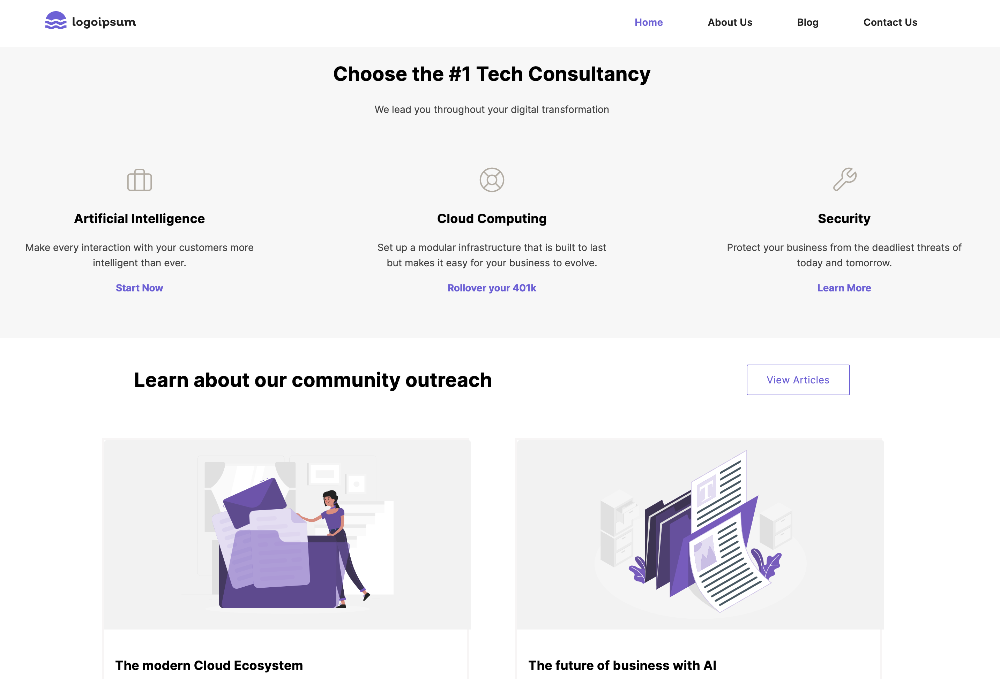

# Graphql-spring-boot-client example application

## Quick starter for graphql api integration in spring boot

Spring Boot is an open-source framework that allows Java developers to create production-grade Spring applications.

This step-by-step guide details how to create a Java sample webapp via spring-boot. This app, powered by Contentstack GraphQL API to fetch content stored in Contentstack and display it on your application.

## Prerequisites

- An IDE, for example, [IntelliJ IDEA](https://www.jetbrains.com/idea/download/) / [STS](https://spring.io/tools) / [VSCode](https://code.visualstudio.com/download) / [Ecllipse](https://www.eclipse.org/downloads/)

- [JDK 1.8 or later](https://www.oracle.com/in/java/technologies/javase/javase-jdk8-downloads.html)

- Gradle 4+ or Maven 3.2+

- [Contentstack account](https://www.contentstack.com/login/)

## Steps to create spring boot app using GraphQl

- Set up a Spring Boot project using the Spring Initializer website or your IDE.
- Add the following dependencies to your pom.xml file:
  - graphql-spring-boot-starter
  - graphql-java-tools
- Create a GraphQL schema file with the schema definition using the GraphQL schema language.
- Implement data fetchers to retrieve the data for the fields in your schema.
- Configure a GraphQL servlet in your Spring Boot application by creating a GraphQLController that maps to the /graphql endpoint.
- Test your GraphQL API by sending a query to the endpoint using a tool like GraphiQL.

### Screenshots

- Home

- About Us

- Our Team

- Blog

- Blogs

- Contact Us

